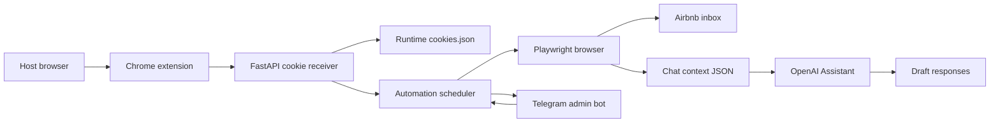
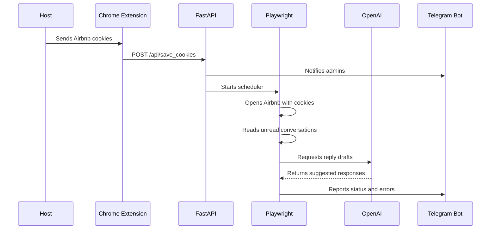

<div align="center">

# AI AirBnb Replyer

**A Telegram-controlled Airbnb host assistant that imports browser cookies, reads unread guest messages with Playwright, and can draft replies with OpenAI.**

[](LICENSE)


</div>

---

## Overview

AI AirBnb Replyer is an automation workspace for Airbnb hosts. It combines a Chrome extension, a FastAPI cookie receiver, Playwright browser automation, OpenAI reply drafting, and a Telegram control bot.

The system is intended for controlled host-side workflows where the operator owns the Airbnb session and uses Telegram as the operational console.

## Core Features

- Chrome extension that collects Airbnb cookies from the active browser session.
- FastAPI endpoint that receives and stores cookies locally at runtime.
- Playwright automation for opening Airbnb, checking unread messages, and collecting chat context.
- OpenAI Assistant integration for drafting guest replies.
- Telegram bot controls for starting, stopping, and monitoring automation.
- Admin notifications for cookie updates, scheduler state, and runtime errors.
- Local JSON output files for message context and generated responses.

## Architecture



## Runtime Flow



## Repository Layout

```text
.
|-- bot/
|   |-- api/                 # FastAPI endpoints and OpenAI integration
|   |-- airbnb_service/      # Playwright automation
|   |-- handlers/            # Telegram bot handlers
|   |-- keyboards/           # Telegram keyboard helpers
|   |-- main.py              # Starts Telegram bot and FastAPI server
|   |-- config.py            # Runtime paths and env access
|   |-- requirements.txt
|   `-- .env.example
|-- extension/
|   `-- airbnb_cookie_sender/ # Chrome extension for cookie upload
|-- LICENSE
`-- README.md
```

## Quick Start

```powershell
cd bot
python -m venv .venv
.\.venv\Scripts\Activate.ps1
pip install -r requirements.txt
playwright install chromium
copy .env.example .env
python main.py
```

By default, the backend listens on `http://localhost:8080`.

## Configuration

Create `bot/.env` from `bot/.env.example`:

```env
BOT_TOKEN=replace-with-your-telegram-bot-token
ADMINS=123456789
OPENAI_API=replace-with-your-openai-api-key
ASSISTANT_ID=replace-with-your-openai-assistant-id
DB_URL=
```

## Chrome Extension Setup

1. Start the backend.
2. Open `chrome://extensions`.
3. Enable Developer Mode.
4. Click "Load unpacked".
5. Select `extension/airbnb_cookie_sender`.
6. Log in to Airbnb in the same Chrome profile.
7. Open the extension and send cookies to the backend.

For a remote deployment, replace the local backend host in the extension files with your own HTTPS endpoint before loading the extension.

## Runtime Files

The following files are created locally during operation and are intentionally ignored:

```text
bot/airbnb_service/cookies.json
bot/airbnb_service/output/
bot/logfile.log
```

These files may contain active Airbnb session cookies, message content, guest details, or generated replies. They must never be committed.

## Security Notes

- Do not commit real `.env` files, cookies, logs, message exports, or generated replies.
- Rotate any Telegram, OpenAI, Airbnb, or tunnel credentials that were ever committed before this cleanup.
- Use this tool only with accounts and conversations you are authorized to operate.
- Restrict the cookie receiver endpoint in production. The development CORS policy is permissive.
- Keep extension host permissions limited to your backend and Airbnb.

## License

This project is released under the [MIT License](LICENSE).
